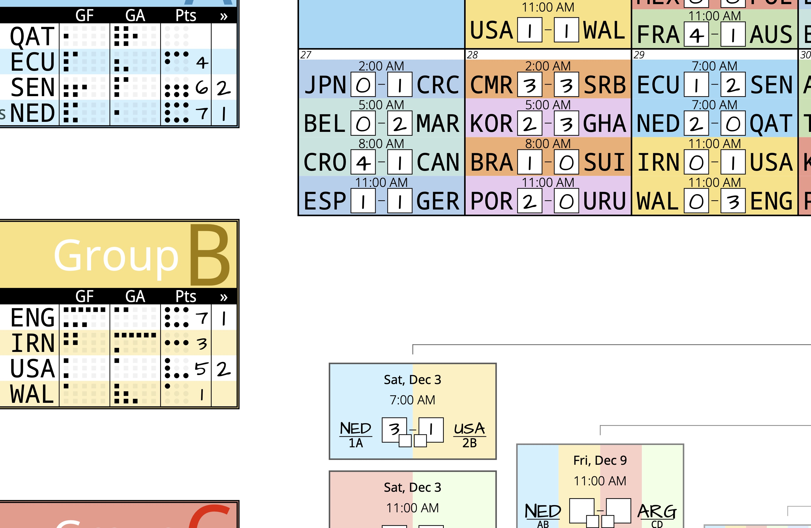

# Bruce's Soccer Tourney Poster Generator

This python script generates posters for the soccer tournaments with group and elimination rounds. It shows all the matches, with spots to fill in scores. There are places to track group stage results. And the knockout stages have places to fill in the teams as they advance.

The initial iteration created posters for the 2022 world cup. Since the team/schedule data is read from an excel sheet, posters can be generated for other tournaments. Known tournaments are xlsx files in the `src/stp/database` subdirectory.

The script can generate PDFs in 25 languages, across any IANA timezone, and in many paper sizes. See [this page](http://soccer-tournament-poster.com) for premade posters to download, instructions, and background on the poster's creation.